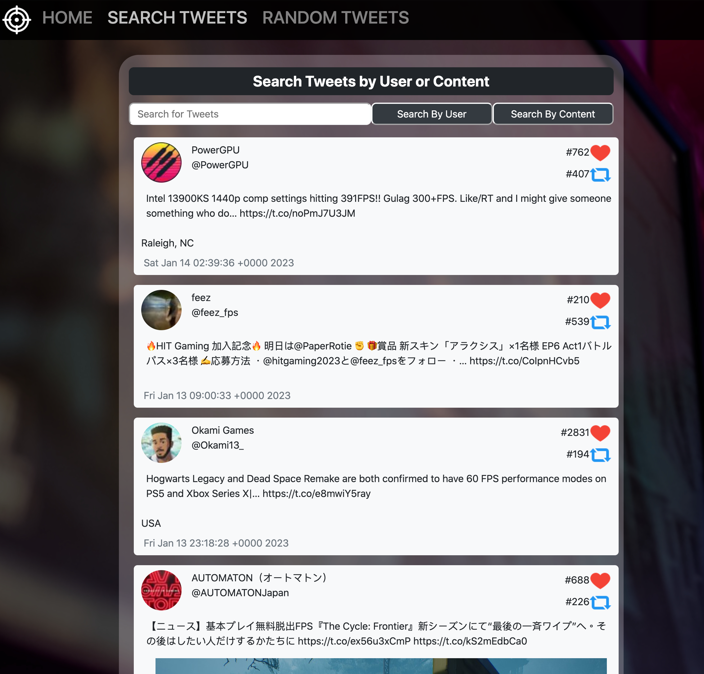

# Twitter Showcase App

A Twitter API Application to search for twitter users or content (React)

Try it out <a href=https://twitter-showcase-app.onrender.com/>here</a>.

<b>Summary</b>

This full-stack API application allows users to access Twitter's API and find some of the latest tweets. By default, the 'Search Tweet' page will feature some of the latest tweets with the 'fps' hashtag but the user can search for tweets by user or by content. Additionally, the user can go to 'Random Tweet' to see a random tweet from five of my favorite FPS gaming studios.

This project was my first time building a full-stack application to interact with API data. It took me some time to wrap my head around how data moves from back-end to front-end and how to best send and receive it but it's been a very exciting process building something from scratch and trying to get your data from the console to being nicely formated and displayed on the page.

<b>Author</b>

<ul><b>Andy Wang</b> - <i>Full-Stack Software Developer - </i><a href=https://www.linkedin.com/in/andy-wang-wreckcreation>LinkedIn</a>
